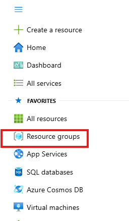
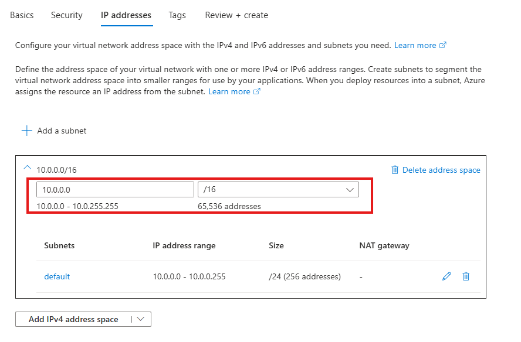
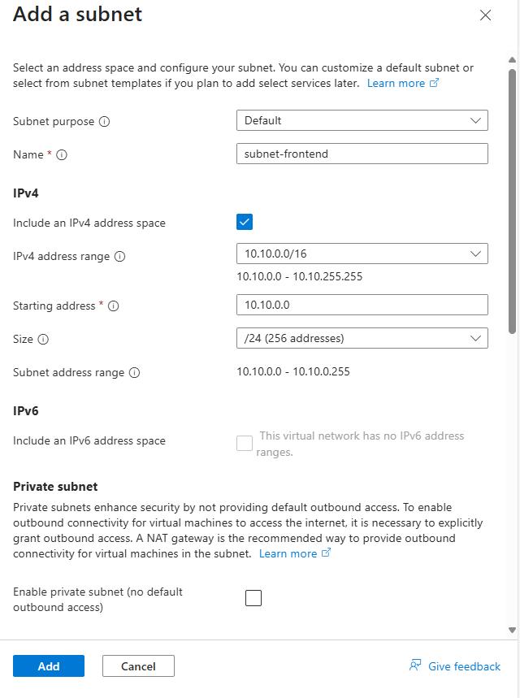
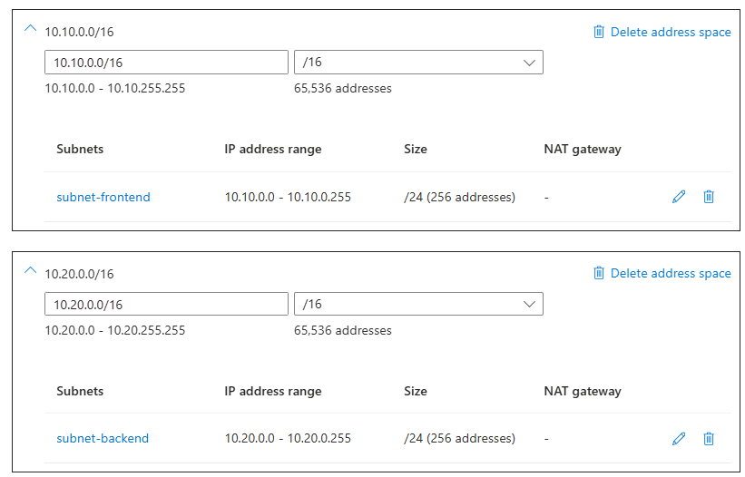
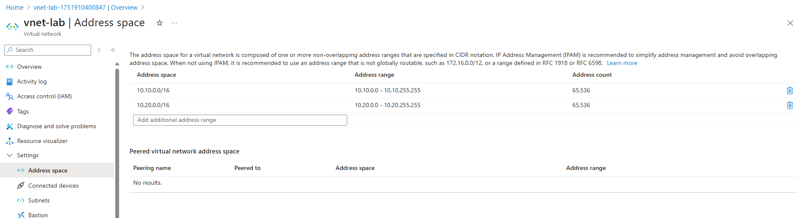

**Lab Exercise: Provisioning an Azure Virtual Network (VNet)**

---

## Lab Overview

In this exercise you will create and configure a Virtual Network in Azure, segment it with subnets, and verify connectivity settings. This hands‑on lab reinforces the core networking concepts and portal navigation.

---

### Objectives

* Navigate to the Azure Portal and locate the Virtual Networks service
* Create a new VNet with a primary CIDR address space
* Add an additional, non‑contiguous address space
* Define and deploy an initial subnet
* Validate and inspect the deployed network

---

### Prerequisites

* Active Azure subscription
* Owner or Network Contributor role on the subscription/resource group
* Familiarity with CIDR notation

---

### Estimated Duration

45 minutes

---

### Lab Environment

* **Portal URL:** [https://portal.azure.com](https://portal.azure.com)
* **Region:** East US (or your nearest region)
* **Resource Group:** `rg-yourname-vnet-lab` (create in this lab)

---

## Exercise Steps

### 1. **Create Resource Group**

1. In the Azure Portal menu, click **Resource groups**.
2. Click **+ Create**, choose your subscription, enter **rg-yourname-vnet-lab**, select **East US**, then **Review + create → Create**. Replace `yourname` with your name without spaces.

> **Why?** Isolating labs in their own RG helps manage, tag, and clean up resources easily.

---

### 2. **Navigate to Virtual Networks**

1. In the search bar, type **Virtual networks**, select **Virtual networks**.
2. Click **+ Create → Azure virtual network**.

---

### 3. **Basics Configuration**

1. **Subscription:** Your subscription.
2. **Resource group:** Select **rg‑yourname-vnet‑lab**.
3. **Name:** `vnet-lab`.
4. **Region:** East US.
5. Navigate to the IP addresses tab:
   
6. **IPv4 address space:** Click on `Add IPv4 address space` and enter `10.10.0.0/16`.

---

### 4. **Add Additional Address Space**

1. Click **AAdd IPv4 address space**, then enter `10.20.0.0/16` to define a second address space.

---

### 5. **Subnets Configuration**

1. Click **+ Add a subnet**.

   * **Name:** `subnet-frontend`
   * **IPv4 address range:** `10.10.1.0/24` 
2. Click **Add**.
3. Click **+ Add a subnet** again, create a second subnet:
   * **Name:** `subnet-backend`
   * **IPv4 Address range:** `10.10.2.0/24`!
   * Your setup should now be similar to the one in the image below:  
4. Click **Next: Tags**.

---

### 6. **Tagging (Optional)**

* Add tag name `Lab` with value `VNet01`.
* Click **Next: Review + create**.

---

### 7. **Review and Create**

1. Verify all settings – especially address spaces and subnets.
2. Click **Create**.
3. Wait for the **Deployment succeeded** notification.

---

## Validation Tasks

**Inspect the VNet**

   * Browse to **vnet-lab** resource.
   * Confirm both address spaces (`10.10.0.0/16`, `10.20.0.0/16`) are listed under **Address space**.
   * Under **Subnets**, verify `subnet-frontend` and `subnet-backend` with correct CIDRs.
   * 

---

**Keep the resources as you will need them for the next exercise**

---

## Discussion Questions

1. **Why add non‑contiguous address spaces?**
2. **How would you integrate this VNet with an on‑premises network?**
3. **What security controls could you apply at the subnet level?**

---

**End of Lab**
You’ve now successfully created, segmented, and validated an Azure Virtual Network!
