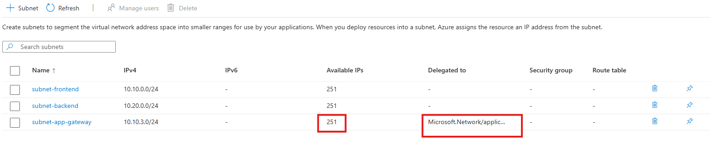

# **Creating Subnets in an Existing Azure Virtual Network**

---

### **Lab Overview**

In this exercise, you'll add new subnets to an existing Azure Virtual Network (VNet), configure address ranges, apply service delegation, and review subnet properties, including usable IP calculations.

---

### **Objectives**

* Locate and open an existing VNet
* Add a new subnet with a specific IP range
* Apply service delegation to the subnet
* Review and confirm settings
* View usable IPs after Azure reservations

---

### **Estimated Duration**

20–30 minutes

---

### **Prerequisites**

* An existing VNet (`vnet-lab` created in a previous lab)
* Azure Portal access with Contributor or Network Contributor rights

---

## **Exercise Steps**

---

### **Step 1: Locate and Open the Existing Virtual Network**

1. Sign in to the [Azure Portal](https://portal.azure.com).
2. Use the search bar at the top to search for **Virtual networks**.
3. Click on **Virtual networks**, then select the VNet named **vnet-lab** (or your assigned VNet name).
4. In the left-hand menu, click **Subnets** under the **Settings** section.

---

### **Step 2: Add a New Subnet**

1. On the Subnets blade, click **+ Subnet** at the top.
2. Fill in the subnet details:

   * **Name:** `subnet-app-gateway`
   * **Subnet starting range:** `10.10.3.0/24` (ensure it doesn’t overlap with existing subnets)
---

### **Step 3: Apply Service Delegation**

1. Scroll down to the **Subnet delegation** section.
2. Click the dropdown and select a service to delegate, such as:

   * `Microsoft.Network/applicationGateways` for **Azure Application Gateway**
3. Once selected, Azure will auto-fill required permissions and APIs. Leave the default settings.

> **Notes:**
> Delegating a subnet allows Azure services to manage IP configurations within it—this is critical for services like Azure Firewall or Azure App Service Environments.

---

### **Step 4: Review and Create the Subnet**

1. Leave remaining fields at default (unless otherwise instructed).
2. Click **Add** at the bottom to create the subnet.

> **Notes:**
> Always double-check your address range and delegation settings before saving. The subnet will now appear in the list and be ready for deployment.

---

### **Step 5: View Subnet Details and Usable IPs**

1. After creation, click the **subnet-app-gateway** name in the list.
2. Review the subnet detail blade. Note:

   * **Address range:** `10.10.3.0/24`
   * **Usable IP addresses:** Azure reserves 5 IPs per subnet; the portal will show **251** usable IPs for a /24 block.

> **Notes:**
> The Azure portal shows you how many IPs are actually usable in a subnet. For example, a /24 gives you 256 IPs, but Azure reserves 5 for infrastructure.

---

### ✅ **Expected Output / Validation**

* Subnet `subnet-app-gateway` appears under the VNet
* Address range is correct
* Delegation is applied to Azure Firewall
* Usable IPs are displayed as expected

---

### **Cleanup (Optional)**

1. Go to the **Virtual network > Subnets** blade.
2. Click the `Delete` next to `subnet-app-gateway`.

---

**End of Lab**
You have successfully added a new subnet to an existing VNet, applied service delegation, and verified usable IPs in the Azure portal.
