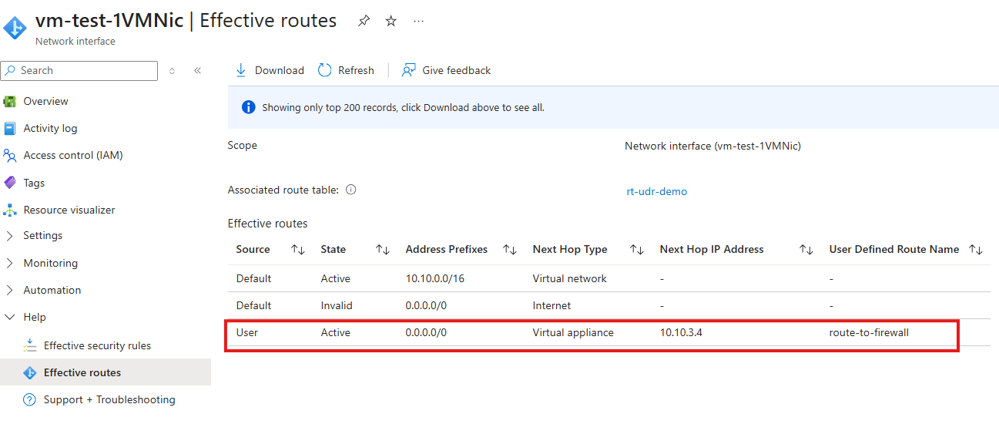
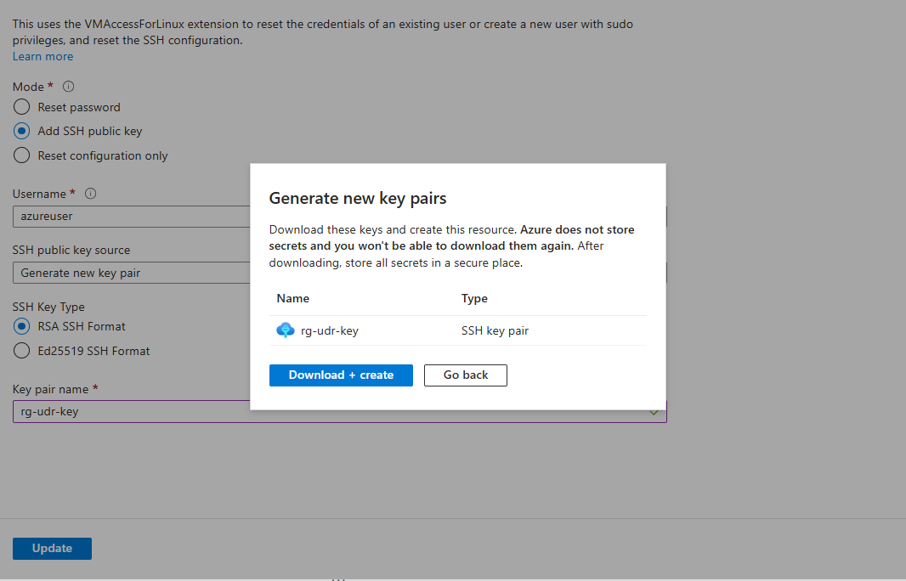

# Implementing User-Defined Routes

## Lab Overview

In this hands-on lab, you will:

* Create a virtual network (VNet) with two subnets
* Deploy two Ubuntu VMs: one to act as a client, and another to simulate a firewall/router
* Create a User-Defined Route (UDR) that routes all outbound traffic from the client VM through the firewall VM
* Verify route effectiveness using Azure tools
* Test connectivity from the client VM through the simulated firewall VM

> **Skill Level:** Beginner
> **Tools Used:** Azure Portal, Azure CLI in Cloud Shell

---

## Part 1: Set Up Network and Virtual Machines

### Step 1: Open Azure Cloud Shell

* Navigate to [https://shell.azure.com](https://shell.azure.com)
* Choose **Bash**

### Step 2: Create a Resource Group

Replace `yourname` with your name without spaces.

```bash
az group create --name rg-yourname-udr-lab --location westus
```

### Step 3: Create a Virtual Network with Two Subnets

```bash
az network vnet create \
  --resource-group rg-yourname-udr-lab \
  --name vnet-lab \
  --address-prefix 10.10.0.0/16 \
  --subnet-name subnet-frontend \
  --subnet-prefix 10.10.1.0/24

az network vnet subnet create \
  --resource-group rg-yourname-udr-lab \
  --vnet-name vnet-lab \
  --name subnet-firewall \
  --address-prefix 10.10.3.0/24
```

### Step 4: Create Two Virtual Machines

#### Create the "firewall" VM:

```bash
az vm create \
  --resource-group rg-yourname-udr-lab \
  --name vm-firewall \
  --image Ubuntu2204 \
  --vnet-name vnet-lab \
  --subnet subnet-firewall \
  --admin-username azureuser \
  --generate-ssh-keys \
  --public-ip-sku Standard
```

#### Create the "client" VM:

```bash
az vm create \
  --resource-group rg-yourname-udr-lab \
  --name vm-test-1 \
  --image Ubuntu2204 \
  --vnet-name vnet-lab \
  --subnet subnet-frontend \
  --admin-username azureuser \
  --generate-ssh-keys \
  --public-ip-sku Standard
```

---

## Part 2: Configure NSGs and Open Ports

### Step 5: Create NSGs

```bash
az network nsg create --resource-group rg-yourname-udr-lab --name nsg-firewall --location westus
az network nsg create --resource-group rg-yourname-udr-lab --name nsg-test-1 --location westus
```

### Step 6: Attach NSGs to NICs

```bash
az network nic update \
  --name vm-firewallVMNic \
  --resource-group rg-yourname-udr-lab \
  --network-security-group nsg-firewall

az network nic update \
  --name vm-test-1VMNic \
  --resource-group rg-yourname-udr-lab \
  --network-security-group nsg-test-1
```

> If you're unsure of the NIC names, run:

```bash
az network nic list --resource-group rg-yourname-udr-lab --query "[].{Name:name}" -o table
```

### Step 7: Add Inbound Rules

```bash
# For vm-firewall
az network nsg rule create --resource-group rg-yourname-udr-lab --nsg-name nsg-firewall --name Allow-SSH --priority 1000 --direction Inbound --access Allow --protocol Tcp --destination-port-range 22 --source-address-prefix '*' --destination-address-prefix '*'
az network nsg rule create --resource-group rg-yourname-udr-lab --nsg-name nsg-firewall --name Allow-HTTP --priority 1001 --direction Inbound --access Allow --protocol Tcp --destination-port-range 80 --source-address-prefix '*' --destination-address-prefix '*'
az network nsg rule create --resource-group rg-yourname-udr-lab --nsg-name nsg-firewall --name Allow-ICMP --priority 1002 --direction Inbound --access Allow --protocol Icmp --destination-port-range '*' --source-address-prefix '*' --destination-address-prefix '*'

# For vm-test-1
az network nsg rule create --resource-group rg-yourname-udr-lab --nsg-name nsg-test-1 --name Allow-SSH --priority 1000 --direction Inbound --access Allow --protocol Tcp --destination-port-range 22 --source-address-prefix '*' --destination-address-prefix '*'
az network nsg rule create --resource-group rg-yourname-udr-lab --nsg-name nsg-test-1 --name Allow-ICMP --priority 1001 --direction Inbound --access Allow --protocol Icmp --destination-port-range '*' --source-address-prefix '*' --destination-address-prefix '*'
```

---

## Part 3: Create and Apply UDR

### Step 8: Get Private IP of vm-firewall

```bash
az vm list-ip-addresses --resource-group rg-yourname-udr-lab --name vm-firewall --query "[0].virtualMachine.network.privateIpAddresses[0]" -o tsv
```

Suppose it returns `10.10.3.4`. Adjust if different.

### Step 9: Create Route Table and Add UDR

```bash
az network route-table create --name rt-udr-demo --resource-group rg-yourname-udr-lab --location westus

az network route-table route create \
  --resource-group rg-yourname-udr-lab \
  --route-table-name rt-udr-demo \
  --name route-to-firewall \
  --address-prefix 0.0.0.0/0 \
  --next-hop-type VirtualAppliance \
  --next-hop-ip-address 10.10.3.4
```

### Step 10: Associate Route Table with Subnet

```bash
az network vnet subnet update \
  --vnet-name vnet-lab \
  --name subnet-frontend \
  --resource-group rg-yourname-udr-lab \
  --route-table rt-udr-demo
```

---

## Part 4: Verify Routing and Connectivity

### Step 11: Use Effective Routes

1. Go to Azure Portal > Virtual Machines > `vm-test-1`
2. Click **Networking** > Network Settings > select the NIC vm-test-1VMNic > Got to **Help** > **Effective Routes**
3. Verify the 0.0.0.0/0 route points to **Virtual Appliance** at **10.10.3.4**


---

## Part 5: Test Traffic Flow

### Step 12: SSH into `vm-test-1`

- Navigate to the `vm-test-1` page
- Click **Connect** under **Connect**
- Click on **More Options** then select **Reset passwords or keys**
- Enter a name for your key pair `e.g. rg-yourname-udr-key`
- Click on **Update** then **Download + create**
- 
- Click **Bastion** under the **Connect** menu
- Click on **Deploy Bastion**
- Wait for ~ 5 minutes for the deployment to complete
- Change the authentication type to `SSH Private Key from Local File`
- Change the username to `azureuser`
- For the Local File, browse to the location of the SSH private key file that you downloaded
- Click on **Connect**

### Step 13: Ping the Firewall VM 

Enter the following command in vm-test-1 bastion terminal
```bash
ping 10.10.3.4
```

You should get a result like the ine shown below:

```bash
azureuser@vm-test-1:~$ ping 10.10.3.4
PING 10.10.3.4 (10.10.3.4) 56(84) bytes of data.
64 bytes from 10.10.3.4: icmp_seq=1 ttl=64 time=1.37 ms
64 bytes from 10.10.3.4: icmp_seq=2 ttl=64 time=12.6 ms
64 bytes from 10.10.3.4: icmp_seq=3 ttl=64 time=1.25 ms
64 bytes from 10.10.3.4: icmp_seq=4 ttl=64 time=1.19 ms
64 bytes from 10.10.3.4: icmp_seq=5 ttl=64 time=1.03 ms
64 bytes from 10.10.3.4: icmp_seq=6 ttl=64 time=1.13 ms
64 bytes from 10.10.3.4: icmp_seq=7 ttl=64 time=1.11 ms
64 bytes from 10.10.3.4: icmp_seq=8 ttl=64 time=1.05 ms
```

### Step 14: Start Web Server on `vm-firewall`

Go to `vm-firewall` and repeat the same steps from `Step 12: SSH into vm-test-1` above to SSH into `vm-firewall` and run:

```bash
sudo apt update && sudo apt install -y apache2
sudo systemctl start apache2
```

### Step 15: Curl the Web Server from `vm-test-1`

```bash
curl http://10.10.3.4
```

You should see the default Apache index page HTML.

---

## Cleanup

```bash
az group delete --name rg-yourname-udr-lab --yes --no-wait
```

---

## Lab Complete

You have successfully:

* Created and secured two VMs
* Configured a UDR to route all traffic through one of them
* Verified the routing and connectivity with Azure tools and CLI

