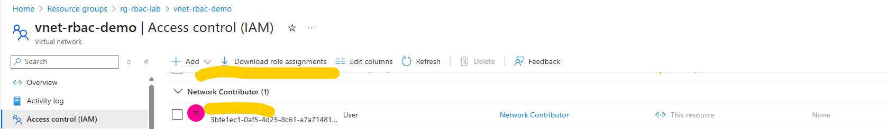

## Lab Overview

In this hands-on lab, you will:

* Provision a virtual network (VNet)
* Assign a built-in network-related role using Azure Role-Based Access Control (RBAC)
* Apply this role to a user, group, or managed identity
* Verify the permissions

> **Skill Level:** Beginner
> **Tools Used:** Azure Cloud Shell (Bash)

---

## Part 1: Set Up Resources

### Step 1: Open Azure Cloud Shell

* Navigate to [https://shell.azure.com](https://shell.azure.com)
* Choose **Bash**

### Step 2: Create a Resource Group

Replace `yourname` with your name without spaces.

```bash
az group create --name rg-yourname-rbac-lab --location westus
```

### Step 3: Create a Virtual Network

```bash
az network vnet create \
  --resource-group rg-yourname-rbac-lab \
  --name vnet-rbac-demo \
  --address-prefix 10.30.0.0/16 \
  --subnet-name default \
  --subnet-prefix 10.30.1.0/24
```

---

## Part 2: Assign a Network Role Using RBAC

### Step 4: Identify the Target Principal (User or Group)

To list available Azure AD users:

```bash
az ad user list --query "[].{Name:displayName, UserPrincipalName:userPrincipalName}" -o table
```

> Pick a userPrincipalName to assign the role to.

Store the username in a variable:

```bash
TARGET_USER="<userPrincipalName-here>"
```

Example:

```bash
TARGET_USER="jane.doe@example.com"
```

### Step 5: Assign "Network Contributor" Role on the VNet

```bash
az role assignment create \
  --assignee $TARGET_USER \
  --role "Network Contributor" \
  --scope $(az network vnet show --name vnet-rbac-demo --resource-group rg-yourname-rbac-lab --query id -o tsv)
```

You shoud get output similar to the following:

```json
{
  "condition": null,
  "conditionVersion": null,
  "createdBy": null,
  "createdOn": "2025-07-09T18:05:32.601030+00:00",
  "delegatedManagedIdentityResourceId": null,
  "description": null,
  "id": "/subscriptions/33266a41-134d-4de7-a780-665b38b0f7b8/resourceGroups/rg-yourname-rbac-lab/providers/Microsoft.Network/virtualNetworks/vnet-rbac-demo/providers/Microsoft.Authorization/roleAssignments/a74ca935-689b-4b81-95ff-e28242265ab4",
  "name": "a74ca935-689b-4b81-95ff-e28242265ab4",
  "principalId": "3bfe1ec1-0af5-4d25-8c61-a7a714810bb5",
  "principalType": "User",
  "resourceGroup": "rg-yourname-rbac-lab",
  "roleDefinitionId": "/subscriptions/33266a41-134d-4de7-a780-665b38b0f7b8/providers/Microsoft.Authorization/roleDefinitions/4d97b98b-1d4f-4787-a291-c67834d212e7",
  "scope": "/subscriptions/33266a41-134d-4de7-a780-665b38b0f7b8/resourceGroups/rg-yourname-rbac-lab/providers/Microsoft.Network/virtualNetworks/vnet-rbac-demo",
  "type": "Microsoft.Authorization/roleAssignments",
  "updatedBy": "ea882dfa-8baa-456f-8b41-54e30d7682ad",
  "updatedOn": "2025-07-09T18:05:33.703040+00:00"
}
```

---

## Part 3: Verify Assigned Role

### Step 6: List Role Assignments for the User

- In the Azure Portal, navigate to the `vnet-rbac-demo` resource
- Select **Access control (IAM)**
- Click the **Role assignments tab**

You should see the following next to the target user:

* **Role:** Network Contributor
* **Scope:** The resource ID of the VNet



---

## Cleanup

In the cloud shell run the following command:

```bash
az group delete --name rg-yourname-rbac-lab --yes --no-wait
```

---

## Lab Complete

You have successfully:

* Created a network resource
* Assigned an RBAC role using CLI
* Verified the permission assignment