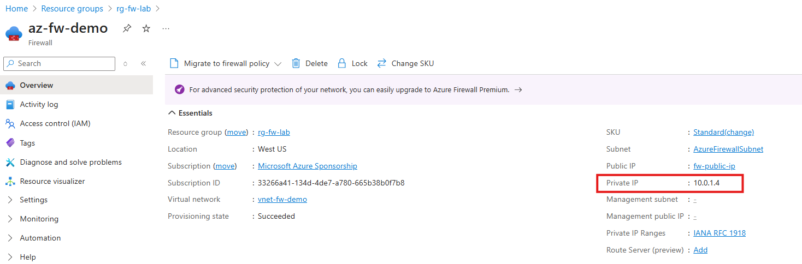

# Implementing User-Defined Routes with Azure Firewall

## Lab Overview

In this hands-on lab, you will:

* Create a virtual network (VNet) with a dedicated AzureFirewallSubnet and a workload subnet
* Deploy Azure Firewall into the VNet and assign it a public IP address
* Create Network Rules to control Layer 3/4 traffic
* Create Application Rules to control Layer 7 traffic based on FQDNs
* Configure a User-Defined Route (UDR) to force outbound traffic through the Azure Firewall
* Deploy a test VM to verify that firewall rules are functioning correctly

> **Skill Level:** Intermediate
> **Tools Used:** Azure Portal, Azure CLI in Cloud Shell (Bash)

---

## Part 1: Network Setup

### Step 1: Open Azure Cloud Shell (Bash)

* Visit [https://shell.azure.com](https://shell.azure.com)
* Ensure Bash is selected, not PowerShell

### Step 2: Create Resource Group

Replace `yourname` with your name without spaces.

```bash
az group create --name rg-yourname-fw-lab --location eastus
```

### Step 3: Create Virtual Network and Subnets

```bash
az network vnet create \
  --name vnet-fw-demo \
  --resource-group rg-yourname-fw-lab \
  --address-prefix 10.0.0.0/16 \
  --subnet-name AzureFirewallSubnet \
  --subnet-prefix 10.0.1.0/24

az network vnet subnet create \
  --name workload-subnet \
  --vnet-name vnet-fw-demo \
  --resource-group rg-yourname-fw-lab \
  --address-prefix 10.0.2.0/24
```

> **Tip:** The subnet name `AzureFirewallSubnet` is **required** for Azure Firewall to deploy successfully.

---

## Part 2: Deploy Azure Firewall

### Step 4: Create a Public IP Address for the Firewall

```bash
az network public-ip create \
  --resource-group rg-yourname-fw-lab \
  --name fw-public-ip \
  --sku Standard \
  --allocation-method Static \
  --location eastus
```

### Step 5: Deploy the Azure Firewall

```bash
az network firewall create \
  --name az-fw-demo \
  --resource-group rg-yourname-fw-lab \
  --location eastus \
  --sku AZFW_VNet \
  --threat-intel-mode Alert
```

Answer Y to: `The command requires the extension azure-firewall. Do you want to install it now? The command will continue to run after the extension is installed. (Y/n): `

### Step 6: Configure Firewall IP Configuration

```bash
az network firewall ip-config create \
  --firewall-name az-fw-demo \
  --name fw-config \
  --resource-group rg-yourname-fw-lab \
  --public-ip-address fw-public-ip \
  --vnet-name vnet-fw-demo
```

### Step 7: Get Firewall Private IP

- Go to the `az-fw-demo` overview page and take note of the Private IP
> **Note:** Save the output (e.g., `10.0.1.4`) — you’ll use it in your route configuration.



---

## Part 3: Configure Firewall Rules

### Step 8: Create a Network Rule Collection

```bash
az network firewall network-rule create \
  --firewall-name az-fw-demo \
  --resource-group rg-yourname-fw-lab \
  --collection-name net-rule-allow-ssh \
  --name allow-ssh \
  --action Allow \
  --priority 100 \
  --protocols TCP \
  --source-addresses '*' \
  --destination-addresses '*' \
  --destination-ports 22
```

> This rule allows SSH traffic from any source to any destination.

### Step 9: Create an Application Rule Collection

```bash
az network firewall application-rule create \
  --collection-name app-rule-allow-web \
  --firewall-name az-fw-demo \
  --name allow-web-outbound \
  --protocols Http=80 Https=443 \
  --resource-group rg-yourname-fw-lab \
  --action Allow \
  --priority 200 \
  --source-addresses '*' \
  --target-fqdns www.microsoft.com
```

> This rule allows outbound web access to [www.microsoft.com](http://www.microsoft.com) from any source in the VNet.

---

## Part 4: Implement UDR to Route Traffic Through Firewall

### Step 10: Create Route Table

```bash
az network route-table create \
  --name rt-fw-routes \
  --resource-group rg-yourname-fw-lab \
  --location eastus
```

### Step 11: Add Default Route to Firewall

```bash
az network route-table route create \
  --resource-group rg-yourname-fw-lab \
  --route-table-name rt-fw-routes \
  --name default-to-fw \
  --address-prefix 0.0.0.0/0 \
  --next-hop-type VirtualAppliance \
  --next-hop-ip-address <FIREWALL_PRIVATE_IP>
```

> Replace `<FIREWALL_PRIVATE_IP>` with the IP from step 7.

### Step 12: Associate Route Table with Workload Subnet

```bash
az network vnet subnet update \
  --name workload-subnet \
  --vnet-name vnet-fw-demo \
  --resource-group rg-yourname-fw-lab \
  --route-table rt-fw-routes
```

---

## Part 5: Deploy and Test a Workload VM

### Step 13: Create Test VM in Workload Subnet

```bash
az vm create \
  --resource-group rg-yourname-fw-lab \
  --name vm-test-fw \
  --image Ubuntu2204 \
  --admin-username azureuser \
  --generate-ssh-keys \
  --subnet workload-subnet \
  --vnet-name vnet-fw-demo \
  --public-ip-sku Standard
```

### Step 14: SSH into VM and Test Internet

- Go to the overview page of `vm-test-fw` and copy the public IP address
- Click **Connect** under **Connect**
- Click on **More Options** then select **Reset passwords or keys**
- Enter a name for your key pair `e.g. rg-yourname-fw-key`
- Click on **Update** then **Download + create**
- Click **Bastion** under the **Connect** menu
- Click on **Deploy Bastion**
- Wait for ~ 5 minutes for the deployment to complete
- Change the authentication type to `SSH Private Key from Local File`
- Change the username to `azureuser`
- For the Local File, browse to the location of the SSH private key file that you downloaded
- Click on **Connect**

Once inside the VM:

```bash
curl http://www.microsoft.com
```

> You should see an HTTP 301 or 200 response if the application rule is working.

---

## Part 6: Cleanup

```bash
az group delete --name rg-yourname-fw-lab --yes --no-wait
```
---

## Lab Complete

You have successfully:

* Deployed Azure Firewall
* Created IP config and assigned a public IP
* Defined Network and Application Rules
* Implemented UDR to route traffic
* Verified traffic flow through Azure Firewall
