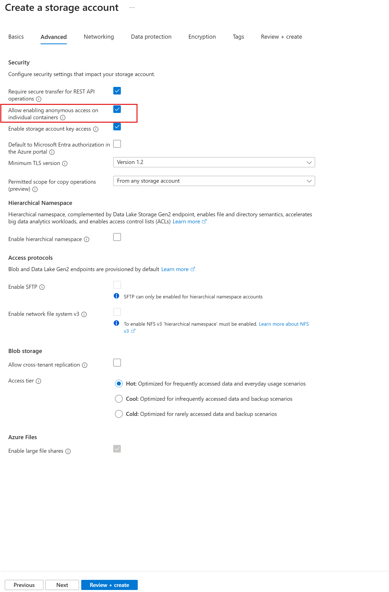
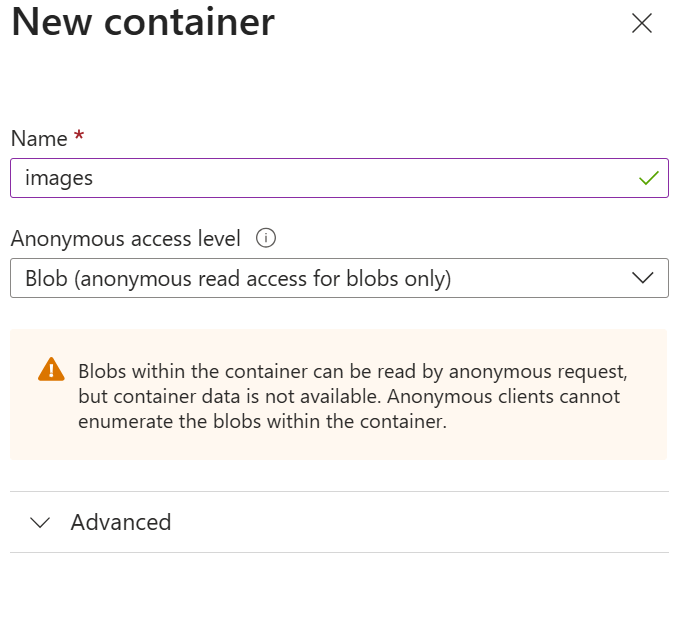
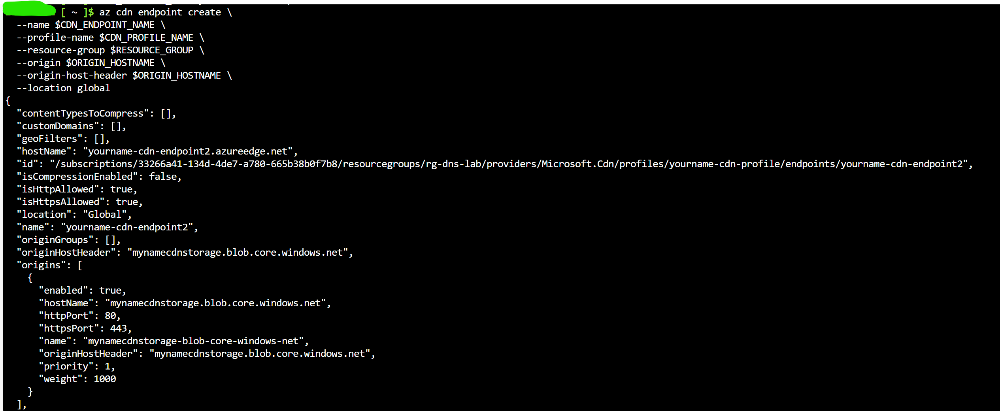

**Lab Exercise: Implementing Azure CDN for Content Caching**

---

## Lab Overview

You will configure Azure CDN to cache static content from Blob Storage, set up caching rules, and test delivery from edge locations. This lab explores content acceleration and security basics.

---

### Objectives

* Create a storage account and upload content
* Set up a CDN profile and endpoint
* Configure caching behavior
* Verify content delivery and caching

---

### Prerequisites

* Active Azure subscription
* Resource group `rg-yourname-dns-lab`

---

### Lab Environment

* **Portal URL:** [https://portal.azure.com](https://portal.azure.com)
* **Region:** East US
* **Resource Group:** `rg-yourname-dns-lab`

---

## Exercise Steps

### 1. **Create Storage Account**

1. Search for **Storage accounts**, click **+ Create**.
2. **Resource group:** `rg-yourname-dns-lab`.
3. **Name:** `mynamecdnstorage` (unique).
4. **Redundancy:** Locally-redundant storage (LRS)
5. Go to the **Advanced** tab then select `Allow enabling anonymous access on individual containers`.  
   
6. Click on **Review + create -> Create**
7. After creation completes, click on **Go to resource**
8. Click on **Data storage -> Containers** then click **+ Add container** 
9. **Name:** images
10. **Anonymous access level:** Blob
11. 
12. Click on **Create**
13. Open the `images` container and click on **Upload** then select any image file from your computer name **test.jpeg**. You can use the image below if you don't have any samples.


---

### 2. **Create CDN Profile**


Open the **Azure Cloud Shell -> Bash**, and follow the steps below to **create a CDN profile and endpoint** for an existing **Azure Storage Account**.

#### 1. **Get the storage account primary endpoint (Web)**

```bash
STORAGE_ACCOUNT_NAME="mynamecdnstorage"
RESOURCE_GROUP="rg-yourname-dns-lab"
LOCATION="eastus"
CDN_PROFILE_NAME="yourname-cdn-profile"
CDN_ENDPOINT_NAME="yourname-cdn-endpoint"
ORIGIN_HOSTNAME="${STORAGE_ACCOUNT_NAME}.blob.core.windows.net"
```
---

#### 2. **Create the CDN profile**

```bash
az cdn profile create \
  --name $CDN_PROFILE_NAME \
  --resource-group $RESOURCE_GROUP \
  --sku Standard_Microsoft
```

> SKU options include:
>
> * `Standard_Microsoft` (default & recommended for basic usage)
> * `Standard_Akamai`
> * `Standard_Verizon`
> * `Premium_Verizon`

---

#### 3. **Create the CDN endpoint**

```bash
az cdn endpoint create \
  --name $CDN_ENDPOINT_NAME \
  --profile-name $CDN_PROFILE_NAME \
  --resource-group $RESOURCE_GROUP \
  --origin $ORIGIN_HOSTNAME \
  --origin-host-header $ORIGIN_HOSTNAME \
  --location global
```

---

### Result

You’ll now have:

* A **CDN Profile** named `yourname-cdn-profile`
* A **CDN Endpoint** named `yourname-cdn-endpoint` pointing to your storage account's static website


---


## Validation Tasks

**Test CDN Delivery**

   * Access `my-cdn-endpoint.azureedge.net/images/test.jpeg`. It should load.
   * Reload multiple times to confirm caching (faster loads).  

---

## Discussion Questions

1. **How does CDN reduce latency?**
2. **What role do Cache-Control headers play?**
3. **When would you use signed URLs for security?**

