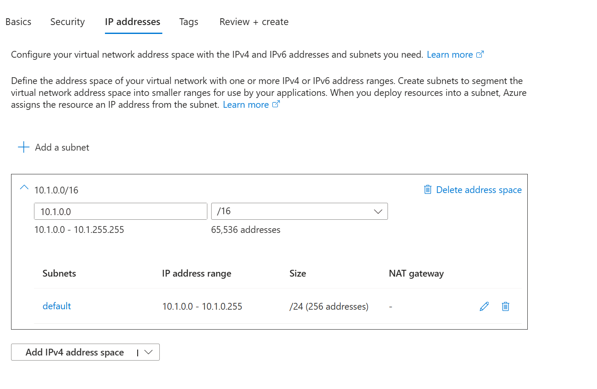
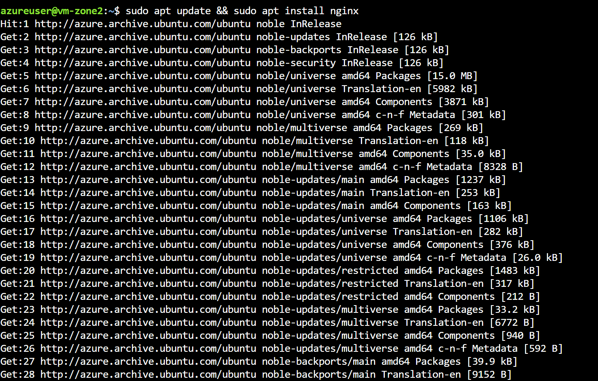

**Lab Exercise: Deploying VMs with Availability Zones for Resilience**

---

## Lab Overview

This lab involves deploying Virtual Machines across Availability Zones, adding a load balancer, and testing high availability. It reinforces fault tolerance in Azure architectures.

---

### Objectives

* Create a VNet and deploy zoned VMs
* Set up a zone-redundant load balancer
* Test traffic distribution and failover

---

### Prerequisites

* Active Azure subscription
* Resource group `rg-yourname-dns-lab`
* Region with zones (e.g., East US 2)

---


### Lab Environment

* **Portal URL:** [https://portal.azure.com](https://portal.azure.com)
* **Region:** East US 2
* **Resource Group:** `rg-yourname-dns-lab`

---

## Exercise Steps

### 1. **Create Virtual Network**

1. Search for **Virtual networks**, click **+ Create**.
2. **Name:** `az-vnet`.
3. Got to **Next -> Next** then under the **IP addresses** tab, change the address space from `10.0.0.0/16` to  `10.0.1.0/16`.  
4. Click **Review + create -> Create**
   

---

### 2. **Deploy VMs in Zones**

1. Search for **Virtual machines**, click **+ Create**.
2. **Name:** `vm-zone1`, **Availability zone:** 1, Go to the `Networking` tab then select **Virtual network:** `az-vnet`.
3. Load balancing options: Azure load balance
4. Click on **Create a load balancer**
5. **Load balancer name:** load-balancer-az
6. Click on **Create**
7. Click **Review + create -> Create**
8. Click on **Download private key and create resource**
9. Repeat for `vm-zone2` in Zone 2. Use Ubuntu image but select the existing load balancer you created in step 5 above.

---


### 4. **Install Web Server**

1. SSH into each VM: `sudo apt update && sudo apt install nginx`. 
2. To SSH, you can open the Azure Cloud Shell and switch to Bash then upload the SSH private keys you downloaded for each VM. After that, run the following commands
   ```bash
   chmod 400 ./<your-private-key>
   ssh -i ./<your-private-key> azureuser@VM_Public_IP_Address
   ```


---

## Validation Tasks

**Test Availability**

   * Access load balancer public IP; it should show Nginx page.
   * Stop one VM; traffic should route to the other.  

---


## Discussion Questions

1. **What SLA do zoned VMs provide?**
2. **How do Availability Zones differ from Sets?**
3. **Why use scale sets for larger deployments?**
