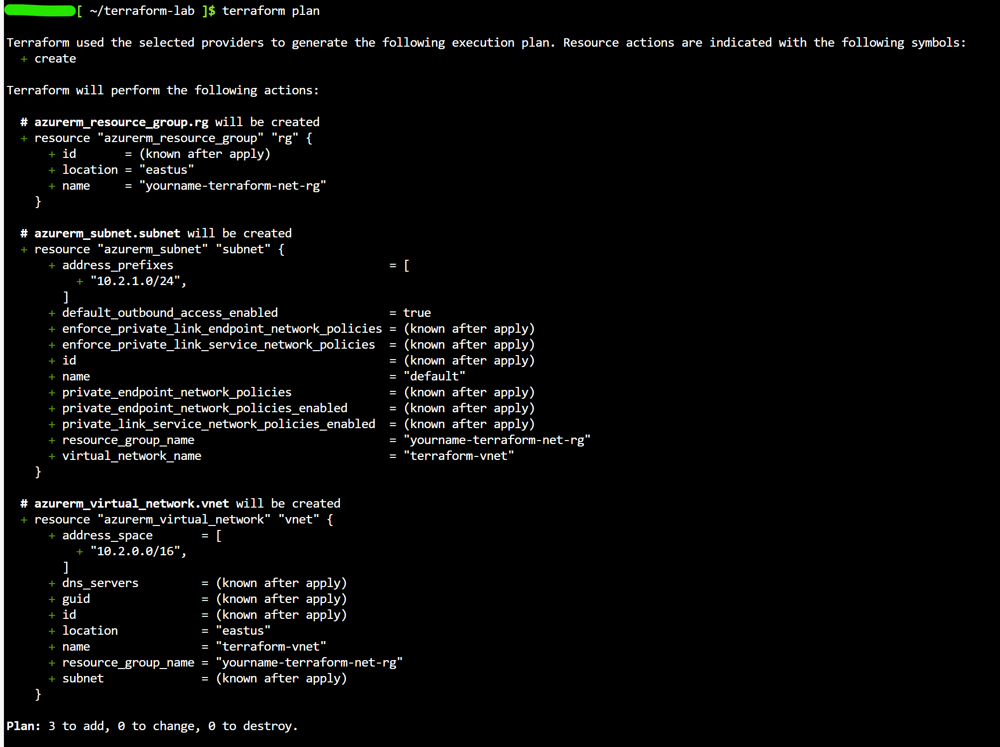
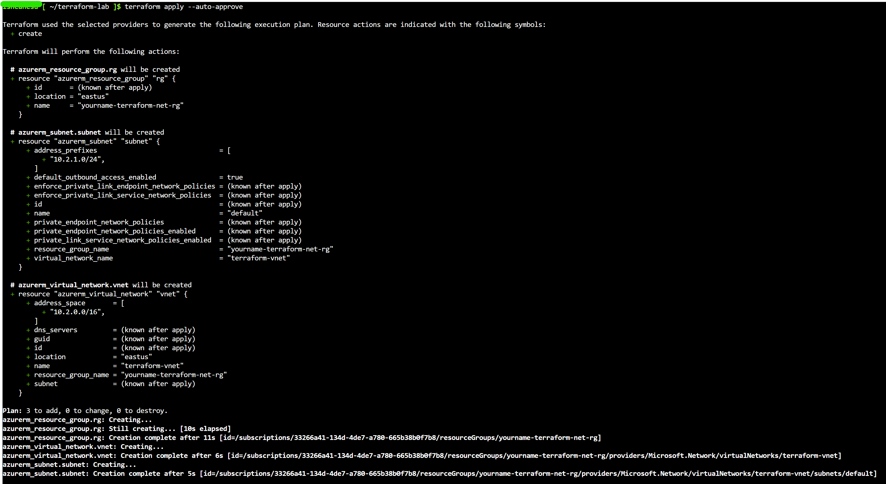

**Lab Exercise: Automating Network Deployment with Terraform**

---

## Lab Overview

In this final lab, you will use Terraform to automate the creation of a VNet and subnet as IaC, building on previous concepts for repeatable deployments.

---

### Objectives

* Install and initialize Terraform
* Write and apply a basic configuration
* Verify and destroy resources

---

### Prerequisites

* Active Azure subscription
* Azure Cloud Shell 

---

### Lab Environment

* **Local Setup:** Terminal/Command Prompt
* **Region:** East US
* **Resource Group:** `terraform-net-rg` (created by Terraform)

---

## Exercise Steps

### 1. **Set Up Terraform Project**

1. Create folder `terraform-lab`, add `main.tf` file.
2. Paste code:  
```hcl
terraform {
  required_providers {
    azurerm = {
      source  = "hashicorp/azurerm"
      version = "~> 3.0"
    }
  }
}

provider "azurerm" {
  features {}
}

resource "azurerm_resource_group" "rg" {
  name     = "yourname-terraform-net-rg"
  location = "East US"
}

resource "azurerm_virtual_network" "vnet" {
  name                = "terraform-vnet"
  address_space       = ["10.2.0.0/16"]
  location            = azurerm_resource_group.rg.location
  resource_group_name = azurerm_resource_group.rg.name
}

resource "azurerm_subnet" "subnet" {
  name                 = "default"
  resource_group_name  = azurerm_resource_group.rg.name
  virtual_network_name = azurerm_virtual_network.vnet.name
  address_prefixes     = ["10.2.1.0/24"]
}
```  

> **NOTE:** Replace `yourname` in `yourname-terraform-net-rg` with your actual name
---

### 2. **Initialize and Plan**

1. Open Azure Cloud Shell and switch to bash terminal 
2. Upload `main.tf` from the `terraform-lab` folder you created in Step 1
3. Run the following commands:
  ```bash
  mkdir terraform-lab
  mv main.tf terraform-lab/main.tf
  cd terraform-lab
  ```
4. Run `terraform init`.
5. Run `terraform plan`.  
  

---

### 3. **Apply Configuration**

1. Run `terraform apply --auto-approve`.  
  

---

## Validation Tasks

**Verify in Portal**

   * Check for `terraform-net-rg` with VNet and subnet.
   * Run `terraform destroy --auto-approve` to clean up. 
   * Delete the `rg-yourname-dns-lab` resource group you created in Lab 7 
   

---

## Discussion Questions

1. **Why use IaC like Terraform?**
2. **How does this differ from portal deployments?**
3. **What providers could you add for multi-cloud?**
