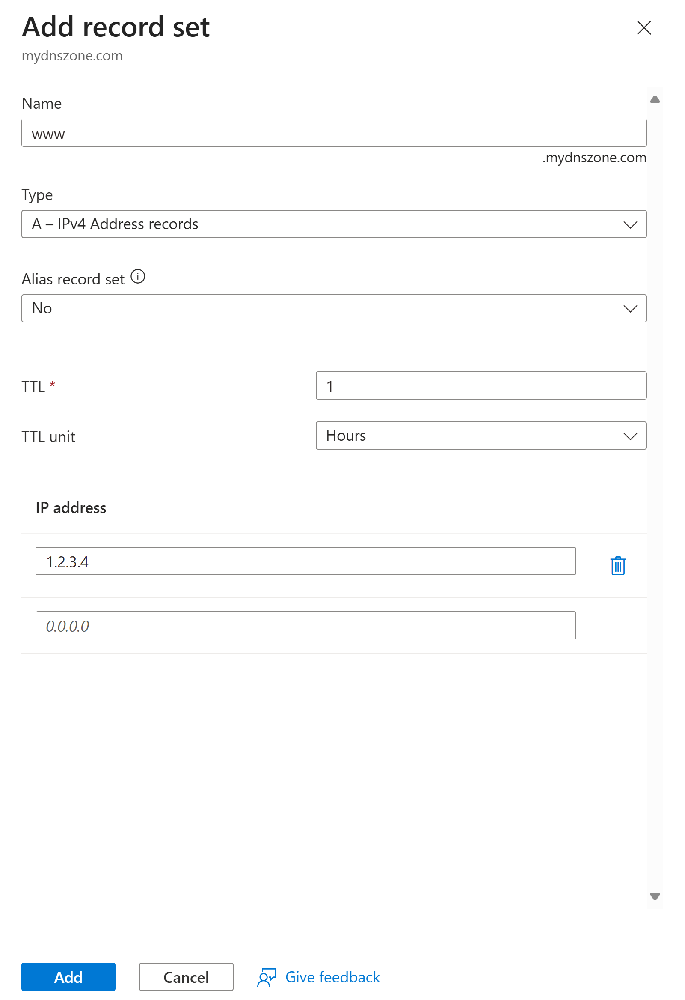

**Lab Exercise: Creating a Public DNS Zone and Records in Azure DNS**

---

## Lab Overview

In this exercise, you will create a public DNS zone using Azure DNS, add common record types like A and CNAME, and verify name resolution. This hands-on lab introduces managed DNS services for hosting public domains and reinforces concepts like zones and record sets.

---

### Objectives

* Navigate to the Azure DNS service in the portal
* Create a new public DNS zone
* Add A and CNAME records to the zone
* Verify DNS resolution using command-line tools
* Understand basic DNS propagation and troubleshooting

---

### Prerequisites

* Active Azure subscription
* Contributor role on the subscription/resource group
* Access to a command prompt or terminal for nslookup

---

### Estimated Duration

30 minutes

---

### Lab Environment

* **Portal URL:** [https://portal.azure.com](https://portal.azure.com)
* **Region:** East US (or your nearest region)
* **Resource Group:** `rg-yourname-dns-lab` (create in this lab)

---

## Exercise Steps

### 1. **Create Resource Group**

1. In the Azure Portal menu, click **Resource groups**.  
   
2. Click **+ Create**, choose your subscription, enter **rg-yourname-dns-lab** replacing yourname with your actual name, select **East US**, then **Review + create → Create**.

---

### 2. **Navigate to DNS Zones**

1. In the search bar, type **DNS zones**, select **DNS zones**.
2. Click **+ Create**.

---

### 3. **Configure the DNS Zone**

1. **Subscription:** Your subscription.
2. **Resource group:** Select **rg-yourname-dns-lab**.
3. **Name:** Enter a domain name like `mydnszone.com` (use a test domain you own or a fictional one for lab purposes).
4. Leave the other properties as defaults
5. Click **Review + create → Create**.

---

### 4. **Add an A Record**

1. Open the newly created DNS zone.
2. Click on `Recordsets` then  click **+ Add**.
3. **Name:** `www`.
4. **Type:** `A`.
5. **TTL:** 1 hour (default).
6. **IP address:** Enter a test IP like `1.2.3.4`.  In a real-world scenario you would enter the actual IP address for a server here.
   
7. Click **Add**.

---

### 5. **Add a CNAME Record**

1. Click **+ Add** again.
2. **Name:** `alias`.
3. **Type:** `CNAME`.
4. **TTL:** 1 hour.
5. **Alias:** Enter `www.example.com`.  
  
6. Click **Add**.

Your Recordsets will now look like this:

---

### 6. **Note Name Servers**

1. In the DNS zone overview, note the four name servers (e.g., ns1-07.azure-dns.com).  
   
   > **Tip?** In a real scenario, you'd update these at your domain registrar for delegation.

---

**End of Lab**  
You’ve now successfully created and managed a public DNS zone in Azure!

