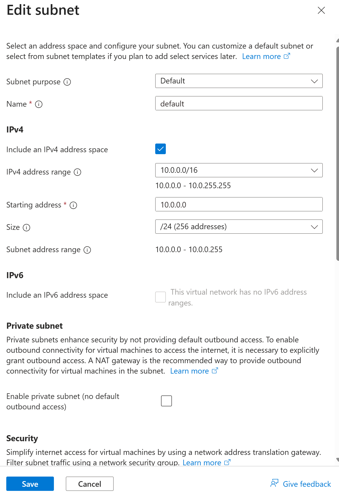
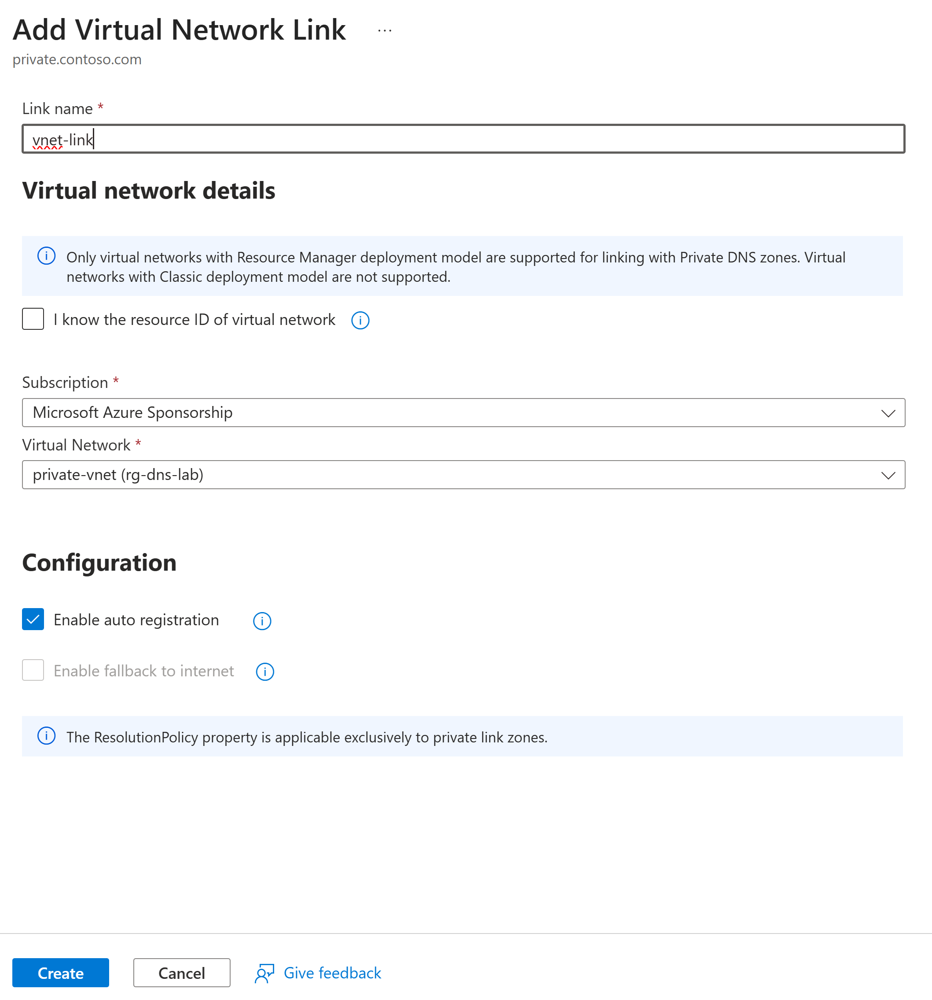
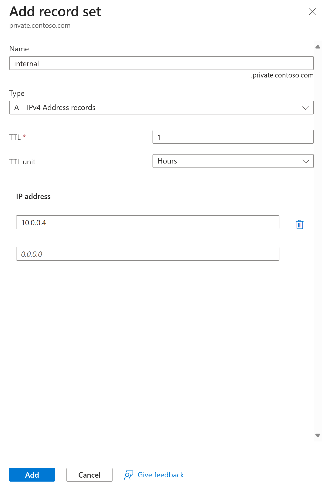
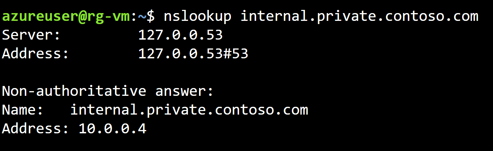
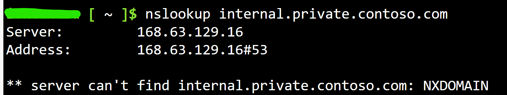

**Lab Exercise: Setting Up a Private DNS Zone in Azure**

---

## Lab Overview

Building on the previous lab, you will create a private DNS zone, link it to a Virtual Network, and add records for internal resolution. This lab focuses on secure, private DNS for Azure resources.

---

### Objectives

* Create a private DNS zone
* Link the zone to an existing Virtual Network
* Add records and verify private resolution
* Understand the role of private DNS in VNets

---

### Prerequisites

* Active Azure subscription
* The resource group `rg-yourname-dns-lab` from the previous lab
* Basic knowledge of Virtual Networks (create one if needed)

---

### Lab Environment

* **Portal URL:** [https://portal.azure.com](https://portal.azure.com)
* **Region:** East US
* **Resource Group:** `rg-yourname-dns-lab` (reuse from previous lab)
* **Virtual Network:** `private-vnet` (create in this lab if not existing)

---

## Exercise Steps

### 1. **Create a Virtual Network (If Not Existing)**

1. Search for **Virtual networks**, click **+ Create**.
2. **Resource group:** `rg-yourname-dns-lab`.
3. **Name:** `private-vnet`.
4. **Region:** East US.
5. Click **Next → Next**
6. Under **IP addresses** leave the default **IPv4 address space:** `10.0.0.0/16`.
8. Leave the default **subnet** `default`, **Address range** `10.0.0.0/24`.  
   
9. Click **Review + create → Create**.

---

### 2. **Create Private DNS Zone**

1. Search for **Private DNS zones**, click **+ Create**.
2. **Subscription:** Your subscription.
3. **Resource group:** `rg-yourname-dns-lab`.
4. **Name:** `private.contoso.com`.  
5. Click **Review + create → Create**.

---

### 3. **Link Zone to VNet**

1. Open the private DNS zone.
2. Click **DNS Management → Virtual network links → + Add**.
3. **Link name:** `vnet-link`.
4. **Virtual network:** Select `private-vnet`.
5. Enable **Enable auto registration**.  
   
6. Click **Create**.

---

### 4. **Add a Record**

1. In the DNS Management blade, click **Recordsets → + Add**.
2. **Name:** `internal`.
3. **Type:** `A`.
4. **IP address:** `10.0.0.4`.  
   
5. Click **Add**.

---

## Validation Tasks

**Verify Private Resolution**

   * (Optional: Deploy a VM in `private-vnet` for testing.)
   * From a VM in the VNet, run `nslookup internal.private.contoso.com`. It should resolve to `10.0.0.4`.
      
   * From outside the VNet (local machine), the query should fail.  
     

---

## Discussion Questions

1. **Why use private DNS zones instead of public ones?**
2. **What happens if auto-registration is disabled?**
3. **How does this integrate with hybrid networks?**

---

