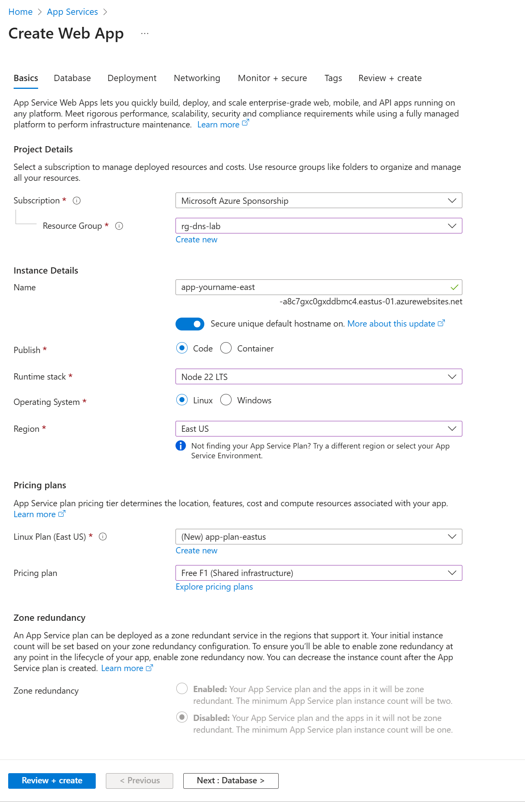
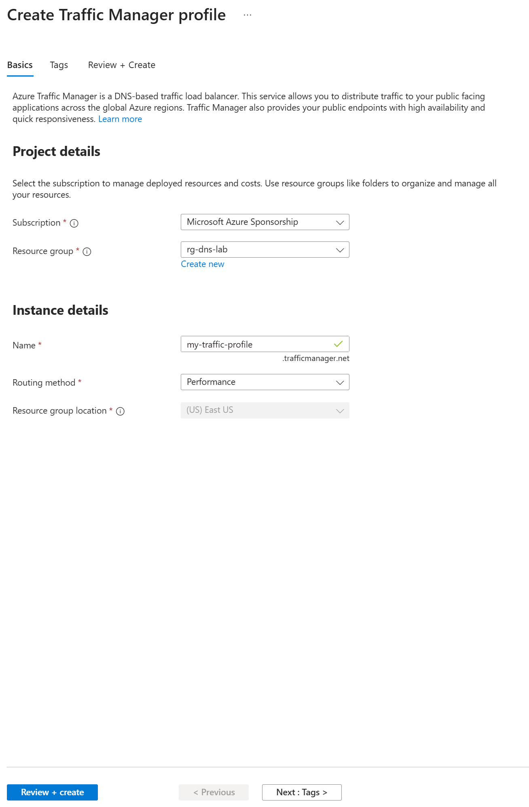
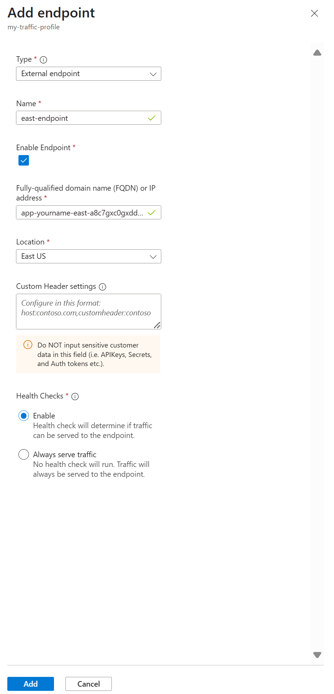

**Lab Exercise: Configuring Azure Traffic Manager for Performance Routing**

---

## Lab Overview

In this exercise, you will set up Azure Traffic Manager to route traffic to endpoints based on performance (lowest latency), add health checks, and simulate failover. This lab covers global DNS load balancing.

---

### Objectives

* Create a Traffic Manager profile
* Add endpoints with health monitoring
* Configure performance routing
* Test routing and failover

---

### Prerequisites

* Active Azure subscription
* Two sample endpoints (e.g., App Services in different regions)
* Resource group `rg-yourname-dns-lab` from previous labs

---

### Lab Environment

* **Portal URL:** [https://portal.azure.com](https://portal.azure.com)
* **Regions:** East US and West Europe
* **Resource Group:** `rg-yourname-dns-lab`

---

## Exercise Steps

### 1. **Create Sample Endpoints**

1. Search for **App Services**, click **+ Create -> + Web App** twice (once per region).
2. For each: **Resource group** `rg-yourname-dns-lab`, **Name** `app-yourname-east`/`app-yourname-west`, **Region** East US/West Europe. **Runtime stack** Node 22 LTS, **Linux Plan** Create a new one `app-plan-eastus/app-plan-westus` and use the Free F1 pricing plan
3. Deploy basic web apps by clicking **Review + create → Create**. Note URLs (e.g., app-yourname-east-a8c7gxc0gxddbmc4.eastus-01.azurewebsites.net).  
   

---

### 2. **Create Traffic Manager Profile**

1. Search for **Traffic Manager profiles**, click **+ Create**.
2. **Name:** `my-traffic-profile`.
3. **Routing method:** Performance.
4. **Resource group:** `rg-yourname-dns-lab`.  
   
5. Click **Review + create → Create**.

---

### 3. **Add Endpoints**

1. Open the profile, click **Settings → Endpoints → + Add**.
2. **Type:** External endpoint, **Name:** `east-endpoint`, **Target:** `app-yourname-east.azurewebsites.net`, **Location:** East US.
3. Click **Add**.
4. Repeat for `west-endpoint` with `app-yourname-west.azurewebsites.net`, Location West Europe.  
   

---

## Validation Tasks

**Test Routing**

   * Wait for a few minutes for Azure to complete checking the endpoints. Once complete, the monitor status will change from `CheckingEndpoints` to `Online` or `Degraded`. If the status is `Degraded`, go to **Settings -> Configuration** and enter `200-299,300-304` for the `Expected Status Code Ranges`. After changing the configuration, Disable and re-enable the profile. You can learn more about endpoint monitoring here: https://learn.microsoft.com/en-us/azure/traffic-manager/traffic-manager-monitoring
   * Run `nslookup my-traffic-profile.trafficmanager.net`. It should resolve to the closest endpoint.
   * Disable one endpoint (set status to Disabled) and retest for failover.  

---

## Discussion Questions

1. **What are the differences between routing methods?**
2. **How do health probes ensure availability?**
3. **When would you use geographic routing instead?**

